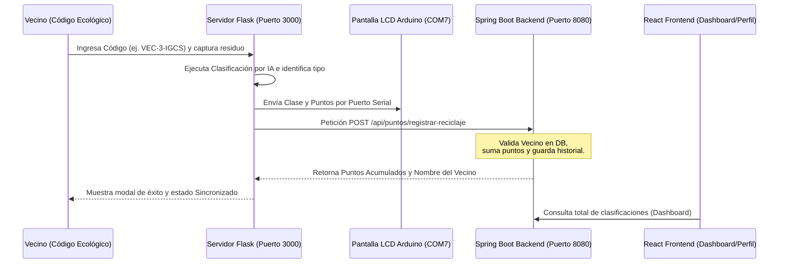

# ♻️ Clasificador de Residuos IA con Integración Arduino

Este módulo contiene el sistema de **Visión Artificial e Inteligencia Artificial** para la clasificación de residuos urbanos, integrado con una pantalla LCD física/simulada (mediante Arduino) y conectado en tiempo real con la plataforma web principal.

## 🚀 Características principales
- **Detección por IA**: Clasifica los residuos depositados en diferentes categorías (Plástico, Cartón, Metal, Vidrio, etc.).
- **Sistema de Puntos**: Calcula puntos ecológicos correspondientes a cada tipo de residuo.
- **Pantalla LCD (Arduino)**: Envía comandos mediante puerto serial (`COM`) para mostrar en tiempo real la categoría detectada y los puntos obtenidos en una pantalla LCD 16x2.
- **Comunicación con el Backend**: Envía de forma automática e instantánea los datos de reciclaje al backend de la plataforma (`Spring Boot`) para acreditar los puntos al vecino correspondiente.
- **Interfaz Web Local**: Dispone de su propio frontend construido en Flask para controlar la cámara, ingresar el código del vecino, capturar la foto del residuo y ejecutar la clasificación.

---

## 🛠️ Requisitos previos
- **Python 3.8+**
- **Librerías principales**: Flask, OpenCV (o el detector configurado en el modelo), y `requests`.
- **Arduino** (Opcional): Placa Arduino con pantalla LCD de 16x2 conectada en el puerto `COM7` (puedes ajustar el puerto serial en `app.py`).

---

## 📥 Instalación

1. Navega al directorio del clasificador:
   ```bash
   cd arduino
   ```

2. Instala las dependencias necesarias:
   ```bash
   pip install -r requirements.txt
   ```
   *(Asegúrate de que la librería `requests` esté instalada ejecutando `pip install requests` si no viene listada).*

---

## ⚙️ Integración y Flujo de Comunicación Local

El sistema opera conectándose localmente con el resto de la plataforma:



1. El servidor Flask corre localmente en el puerto `3000`.
2. Al realizar una clasificación exitosa, realiza una petición `POST` a `http://localhost:8080/api/puntos/registrar-reciclaje` enviando:
   ```json
   {
     "codigoCliente": "VEC-3-IGCS",
     "puntos": 15,
     "clasificacion": "PLASTIC"
   }
   ```
3. El backend actualiza la base de datos de PostgreSQL sumando los puntos al vecino `3` y retornando su nombre y saldo total de puntos.
4. El Dashboard del frontend de React se sincroniza automáticamente consultando al backend el total de clasificaciones IA a través de la API `GET /api/puntos/total-clasificaciones`.

---

## 🏎️ Instrucciones de Ejecución

1. Asegúrate de tener levantado el backend en Spring Boot (`http://localhost:8080`).
2. Arranca el clasificador de Python:
   ```bash
   python app.py
   ```
3. Abre tu navegador e ingresa a:
   `http://localhost:3000/clasificar` (o `https://localhost:3000/clasificar` según tu certificado de Flask).
4. Introduce el código ecológico de un Vecino (disponible en la sección de "Mi Perfil Ecológico" en la aplicación React).
5. Toma la fotografía del residuo y haz clic en **Clasificar con IA**.
6. Observa la pantalla LCD (o consola de Arduino) y el modal de éxito en pantalla, el cual indicará que ha sido **Sincronizado** con el sistema.